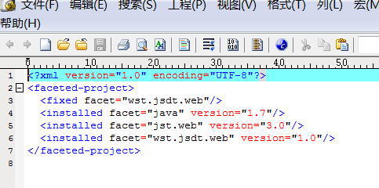

##主要问题##
1. XDoclet错误：Missing library: xdoclet-1.2.1.jar. Select the home directory for XDoclet. 1.2.1   
解决方案：  
(1)Go to http://sourceforge.net/projects/xdoclet/files/xdoclet/1.2.1/  
(2)download xdoclet-bin-1.2.1.zip  
(3)把XDoclet Home设置为xdoclet的lib目录
2. Cannot change version of project facet Dynamic Web Module to 3.0  
解决方案：  
在.settings子目录里面，用文本编辑器打开org.eclipse.wst.common.project.facet.core.xml配置文件，修改jst.web的版本为3.0，如图所示：  

  